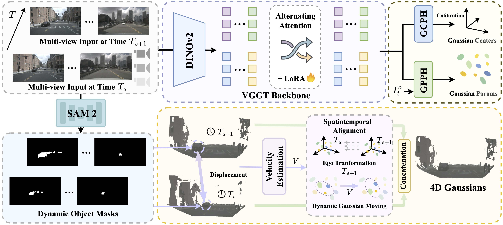

<div align="center">   
  
# ReconDrive: Fast Feed-Forward 4D Gaussian Splatting for Autonomous Driving Scene Reconstruction
</div>

<h3 align="center">
  <a href="">arXiv</a> |
  <a href="https://github.com/TuojingAI/ReconDrive">Code</a> |
  <a href="https://huggingface.co/TuojingAI/ReconDrive/blob/main/recondrive_stage2.ckpt">Checkpoint</a>
</h3>



<br><br>

## Table of Contents:
1. [Highlights](#high)
2. [News](#news)
3. [Getting Started](#getting-started)
    - [Installation](docs/INSTALL.md)
    - [Prepare Dataset](docs/DATA_PREP.md)
    - [Train/Eval](docs/TRAIN_EVAL.md)
4. [TODO List](#todos)
5. [License](#license)
6. [Citation](#citation)

## Highlights <a name="high"></a>

- ReconDrive is a feed-forward framework that extends 3D foundation models for rapid, high-fidelity 4D Gaussian Splatting generation. This prototype establishes a scalable path toward realistic closed-loop evaluation for autonomous driving through efficient reconstruction and novel-view synthesis.

## News <a name="news"></a>

- **`2026/02/23`** ReconDrive is released and open-sourced.


## Getting Started <a name="getting-started"></a>

- [Installation](docs/INSTALL.md)
- [Prepare Dataset](docs/DATA_PREP.md)
- [Evaluation Example](docs/TRAIN_EVAL.md)


## TODO List <a name="todos"></a>
- [x] Base-model code release (on ReconDrive)
- [x] Base-model configs & checkpoints (on ReconDrive)
- [ ] Support more datasets


## License <a name="license"></a>

All assets and code are under the [Apache 2.0 license](./LICENSE) unless specified otherwise.

## Citation <a name="citation"></a>

Please consider citing our paper if the project helps your research with the following BibTex:

```bibtex
@inproceedings{yu2024_univ2x,
 title={ReconDrive: Fast Feed-Forward 4D Gaussian Splatting for Autonomous Driving Scene Reconstruction}, 
 author={Haibao Yu and Kuntao Xiao and Jiahang Wang and Ruiyang Hao and Guoran Hu and Yuxin Huang and Haifang Qin and Bowen Jing and Yuntian Bo and Ping Luo},
 booktitle={Arxiv},
 year={2026}
}
```

## Related resources

[](https://awesome.re)
- [VGGT](https://github.com/facebookresearch/vggt)